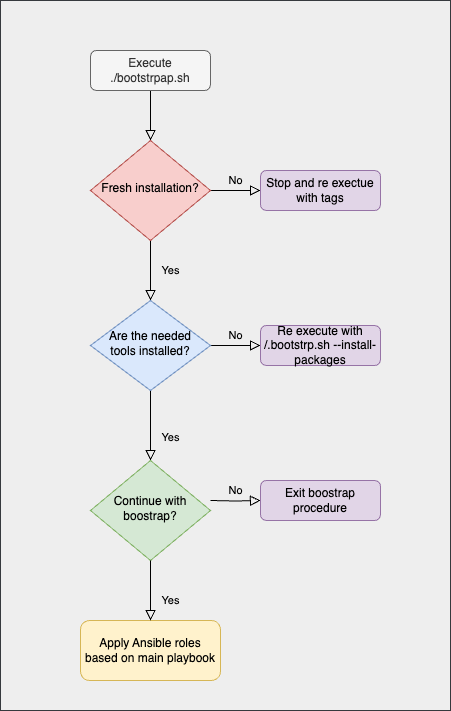

> [!IMPORTANT]
> I'm sure that many aspects of this repository can be done in a better, more intelligent way. If you have suggestions or enhancements, please feel free to open a PR!<br>
> Tested with: Ansible v2.18.4 & macOS Sequoia 15

- [🔍 Overview](#-overview)
- [📝 Prerequisites](#-prerequisites)
- [🚀 New System Bootstrap](#-new-system-bootstrap)
- [📐 Boostrap Execution Flow](#-boostrap-execution-flow)
- [🖥️ Bootstrap Script Usage](#️-bootstrap-script-usage)
  - [Full Installation](#full-installation)
  - [Partial Installation](#partial-installation)
- [🖥️ Ansible Playbook Usage](#️-ansible-playbook-usage)
  - [New role creation](#new-role-creation)
- [🛡️ Security](#️-security)
- [⚙️ Customization](#️-customization)
- [🐞 Issues / 📝 TODOs](#-issues---todos)
- [🤝 Contributing](#-contributing)
- [🔗 Connect](#-connect)
- [🧑‍💻 About Me](#-about-me)

## 🔍 Overview

This is a Bash wrapper that uses a set of Ansible roles, to automate the macOS package installation and configuration of various applications, dependencies, plugins, fonts, and system settings.

## 📝 Prerequisites

While this setup is customized to my specific needs, I hope that parts of the code can be helpful or inspiring to others as well.

If you plan to adapt and use the bootstrap wrapper in its entirety, please ensure you have the following prerequisites in place:

- An active Bitwarden Account
- An already configured,encrypted and initiated Chezmoi repository
- An already configured and encrypted Dotbot repository
- An already configured and encrypted repository that keeps GPG,SSH and other relevant keys (or a path to your GPG keys but you need to adapt the relevant task)

Have a look at this [post](https://myhomelab.gr/automation/2025/06/26/dotfiles-management.html), explaining why I'm using both Chezmoi and Dotbot dotfile managers.

If the prerequisites feel overwhelming or unnecessary, you can skip ahead to the [Ansible Playbook Usage](#ansible-playbook-usage) section.

## 🚀 New System Bootstrap

`bootstrap.sh` prepares the system by installing essential tools, such as Homebrew, Ansible, Bitwarden CLI, Ente Auth, Transcrypt, iTerm2 etc, required by the Ansible roles.

It also installs [Ultimate Vimrc](https://github.com/amix/vimrc) and [oh-my-zsh](https://ohmyz.sh/) including relevant themes and useful plugins.

Ansible roles then handle package installation, global settings configuration,font installation, gpg key importing and dotfile initialization, using both Chezmoi (for templated dotfiles) and Dotbot (for standard dotfiles). This [post](https://myhomelab.gr/automation/2025/06/26/dotfiles-management.html) explains why I'm using two dotfile managers.

## 📐 Boostrap Execution Flow
<a></a>

## 🖥️ Bootstrap Script Usage

```shell
./bootstrap.sh --help                     # Show help message
./bootstrap.sh --install-packages         # Install prerequisite packages
./bootstrap.sh --tags "brew,krew"         # Run with specific tags
./bootstrap.sh --tags "cz" --ask-vault-pass # Use vault password for roles that are using encrypted files.
```
### Full Installation

1. As you can also see from the *Execution Flow diagram*above, first step in case of a fresh setup, is to install all relevant packages. Open the Terminal app and execute:
	
```shell
/bootstrap.sh --install-packages
```

> [!TIP]
> I have seen weird behaviour when executing the wrapper from Terminal app, especially when it comes to env variables, this is why I run next step via iTerm2.

2. Now we are ready to proceed with the full installation, execute below command and follow instructions:
```shell
/bootstrap.sh
```

In a full installation, the available ansible roles are executed in the following order: 

- defaults
- homebrew_packages
- bitwarden
- chezmoi
- config_files
- gpg_import
- krew_plugins

You can find a README file inside each of the roles folder.

### Partial Installation

In case this is not a fresh setup and tools are present, wrapper can be used to keep your system up to date, either for example to install a new package or re apply dotfile sylminks.

```shell
./bootstrap.sh --tags "brew"         # It will install all packages found in the roles/homebrew_packages/vars/main.yaml
```

## 🖥️ Ansible Playbook Usage

Ansible roles, can be executed in a standalone mode in case bootstrap wrapper isn't useful in your case.

Some examples are found below:

```yaml
ansible-playbook main_playbook.yml --ask-vault-pass # to execute all tasks
ansible-playbook main_playbook.yml --ask-vault-pass --tags "cz" # to execute only specific roles which uses encrypted files
ansible-playbook main_playbook.yml --tags "brew", "krew" # to execute package and krew installation
```

### New role creation

If you want to create a new role:

```yaml
ansible-galaxy init <role name>
```

Include the role in your playbook:

```yaml
- hosts: localhost
  roles:
    - {role: 'fancy_role', tags: 'fn'}
```

## 🛡️ Security 

In case you want to fork or download and adapt the code found in the repository, it is strongly recommended that you encrypt files like **key.txt** (used for exampl by Chezmoi Age Encryption) and any other file that holds sensitive info. 
I haven't done it here in order to show you what an [age](https://www.chezmoi.io/user-guide/encryption/age/) file would look like before encryption, in case you want to follow the same setup.

Check [ansible-vault](https://docs.ansible.com/ansible/latest/vault_guide/vault_encrypting_content.html), [transcrypt](https://github.com/elasticdog/transcrypt) and Chezmoi [encryption](https://www.chezmoi.io/user-guide/encryption/) for more details.

## ⚙️ Customization

In case you do have a separate repo for your dotfiles, gpg keys etc , then update `chezmoi_init_url`, `gitlab_repo_url` variable in the roles that use it (chezmoi, config_files, gpg_import). Otherwise, comment out the relevant roles in main `main_playbook.yml`.

This procedure is heavily depended to Bitwarden in order to retrieve tokens used during the playbook runtime. If you intend to use this only for package installation, then disable all roles except `homebrew_packages`.

The `homebrew_packages` role is designed to install only the packages listed under *brew_cask_packages* and *brew_packages* by default — these are packages I want available on every machine.
For fresh installations, I also want to include the packages listed under *brew_cask_bootstrap_packages*. However, I don’t want these bootstrap packages to be installed every time I run the role.
To handle this, I’ve added a flag in *homebrew_packages*/defaults/main.yml. You can either:
	•	Set the flag to true, or
	•	Use the corresponding Ansible tag to trigger the bootstrap package installation.
```shell
ansible-playbook main_playbook.yml --tags "brew" --extra-vars install_cask_bootsrap_packages=true
```

For more customization details, check README files found in each roles folder (wip).

## 🐞 Issues / 📝 TODOs

* Include usage examples and dependencies in each role's README files.
* bootstrap script may need some more sanity checks.
* merge similar tasks, like cloning and decrypting repos used during the fresh installation, in one role.
* `gpg_import` role is re-importing keys even if the keys are present.

## 🤝 Contributing

Contributions and suggestions are welcome! If you spot something that could be improved (and I'm sure you'll find a lot :) ), please open an issue or submit a pull request.

## 🔗 Connect

<p align="left">
<a href="https://linkedin.com/in/roupasz" target="blank"></a>
<a href="https://instagram.com/paparoup_" target="blank"></a>

## 🧑‍💻 About Me

<a href="https://zoisroupas.dev/" target="_blank">

</a>

I'm a DevOps Engineer specializing in hybrid infrastructure architecture and implementation. I design, deploy, and optimize systems across both on-premise environments and cloud platforms, focusing on automation, CI/CD pipelines, and infrastructure as code to create scalable, resilient solutions.

[Check out my Blog](https://myhomelab.gr/) ✍️